#### git分支管理

1. 1.创建与合并分支

​        git把之前每次提交的版本串成一条时间线，这条时间线就是一个分支。

截止目前只有一条时间线，在git里，这个分支叫**主分支**，即**master**分支。HEAD

严格来说不是指向提交，而是指向master，master才是指向提交的，所以，HEAD

指向的就是当前分支。

​       开始的时候，master分支是一条线，git用master指向最新的提交，再用HEAD

指向master，就能确定当前分支，以及当前分支的提交点。

​        每次提交，master分支都会向前移动一步，这样，随着不断提交，master分支的线

也越来越长。

​        当创建新的分支，例如dev时，git新建了一个指针叫dev，指向master相同的提交，再

把HEAD指向dev，就表示当前分支在dev上。

​        git创建一个分支很快，因为除了增加一个dev指针，改HEAD的指向，工作区的文件都没有任何变化。

​        对工作区的修改和提交就是针对dev分支了，比如新提交一次后，dev指针往前移动一步，而master指针不变。

​        合并分支，就可以把dev合并到master上，git怎么合并？最简单的方法，就是直接把master指向dev的当前提交，就完成合并。

​        合并完分支后，甚至可以删除dev分支。删除dev分支就是把dev指针给删掉，删掉后，就剩下一条master分支。

案例：

1. 执行如下命令可以查看当前有几个分支并且看到在哪个分支下工作：

   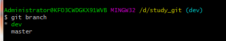

2. 创建一个分支并切换到分支上进行工作

   git checkout -b dev 

   

3. 修改code.txt内容，在里面添加一行，并进行提交：

   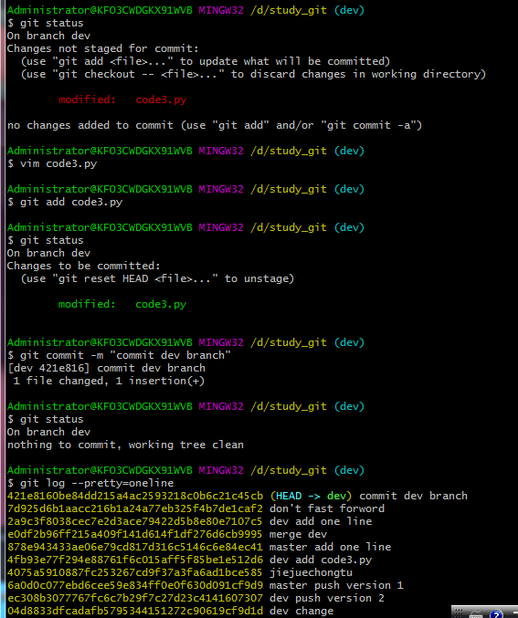

4.  dev分支的工作完成，就可以切换回master分支：

   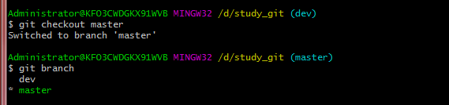

5. 可以把dev分支的工作成果合并到master分支上：

   git merge dev  #默认使用快速合并

   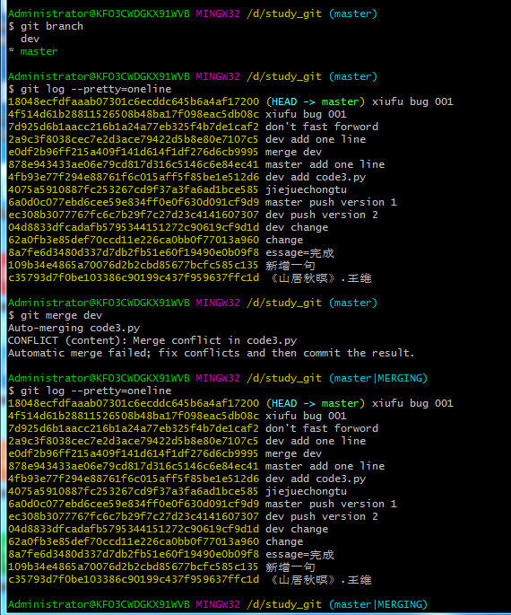

6. 合并完成后，就可以删除dev分支了，删除后，查看branch，就只剩下master分支了：

   git branch -d dev

   git branch

   

   小结：

   查看分支：git branch

   创建分支：git branch <name>

   切换分支：git checkout <name>

   创建+切换分支：git checkout -b <name>

   合并某分支到当前分支：git merge <name>

   删除分支：git branch -d <name>

解决冲突

案例

1. 再创建一个新的分支

   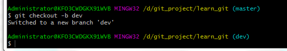

2. 修改code.py内容，进行提交。

   

3. 切换回master分支

   git checkout master

   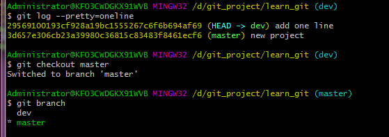

4. 在master的code.txt添加一行内容并进行提交。这种情况下，git无法执行“快速合并”，只能试图把各自的修改合并起来，但这种合并就可能会冲突。

   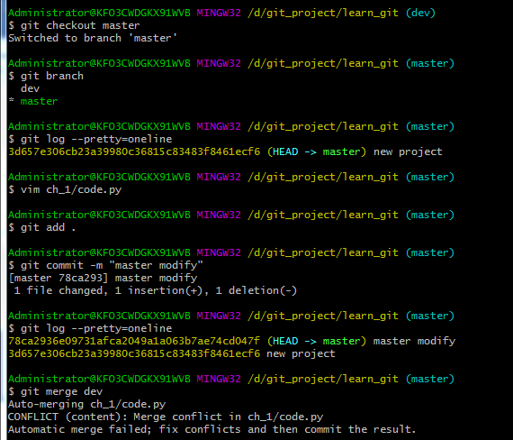

5. 执行如下命令尝试将dev分支合并到master分支上来。

    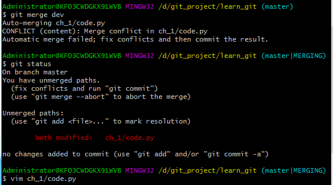

6. git status 会告诉我们冲突的文件：

   

7. 查看code.py的内容

8. 手动修改冲突

9. 再次提交：

   git add、git commit

10. 分支合并

11. git log --graph --pretty=oneline查看分支的合并情况

    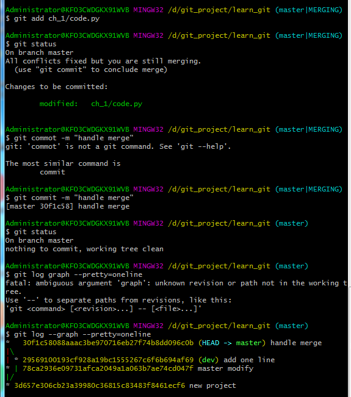

12. 删除dev分支

​      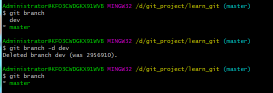

合并分支起冲突：

1、解决冲突

2、重新提交

3、删除dev分支

分支管理策略

通常情况下，合并分支时，如果可能，git会用fast forward模式，但是有些快速合并不能成为但合并时没有冲突。这个时候会合并之后做一次新的提交。但这种模式下，删除分支后，会丢掉分支信息。

案例

1. 创建分支切换到dev分支下

   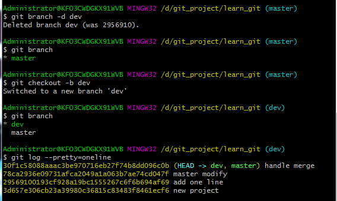

2. 新建一个文件code3.py编辑内容如下，并提交一个commit

   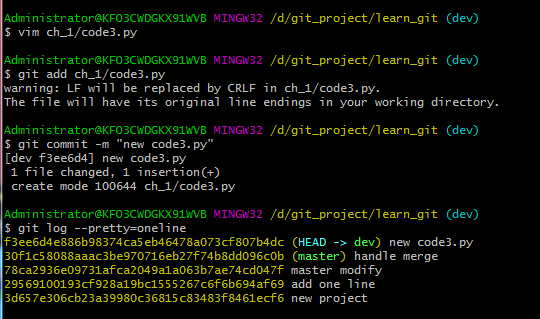

3. 切换回master分支，编辑code.py并进行一次提交

   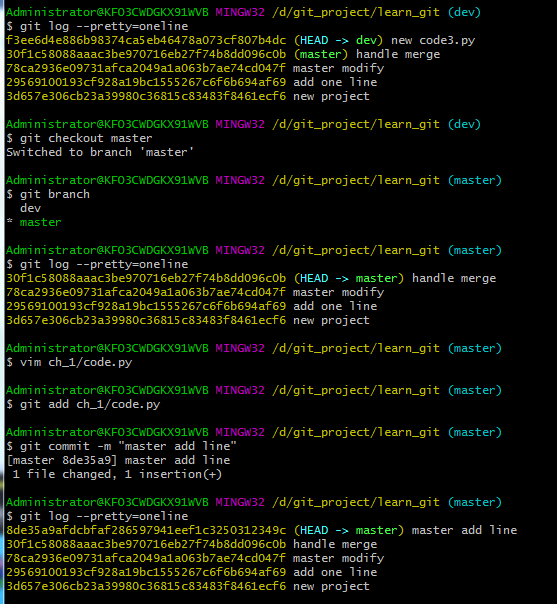

4. 合并dev分支的内容到master分支。

   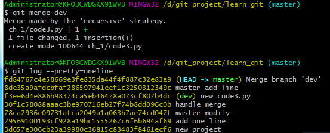

5. 这次不能进行快速合并，所以git提示输入合并说明信息，输入之后合并内容之后git会自动创建一次新的提交。

如果要强制禁用fast forward模式， git就会在merge时生成一个新的commit，这样，从分支历史上就可以看出分支信息。

1.创建并切换到dev分支

git checkout -b dev

2.修改code.txt内容，并提交一个commit

3.切换回master分支

4.合并分支，--no-ff参数，表示禁止fast forword，

bug分支

每个bug都可以通过一个新的临时分支来修复，修复后，合并分支，然后将临时分支删除。

git还提供了一个stash功能，可以把当前工作现场保存起来，等以后恢复现场后继续工作

git stash #保存现场

git stash pop   #恢复现场

1. 111111
2. 33333
3. 44

